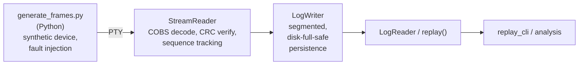

# Black Box Telemetry Pipeline

A software-defined black box recorder for embedded telemetry: a
binary wire protocol, a fault-tolerant capture pipeline, and offline
replay/analysis tooling — designed the way real market-data and
flight-recorder protocols are, with sequence numbers, framing, and
CRCs doing real work, not decoration.

Built as a software companion to [imu-telemetry](https://github.com/usmanchaudry175/imu-telemetry)
(a bare-metal IMU sensor fusion project), sharing only the wire
format — kept as two separate repos deliberately (see D-numbered
decisions in `docs/design.md`).

## What this is

A device (real or, for now, a Python-simulated one) streams
COBS-framed, CRC-protected binary frames over a serial-like
transport. This pipeline:

- **Decodes** the stream, detecting corruption, gaps, duplicates,
  and out-of-order frames — never silently absorbing any of them
- **Persists** frames to disk in a segmented, append-only log,
  surviving disk-full conditions and hard process kills without
  corrupting what was already durably written
- **Replays** a recorded log, reconstructing exactly what happened —
  including every fault that occurred during capture

Every design decision is documented and justified in
[`docs/design.md`](docs/design.md) (D1–D19 at time of writing),
written as decisions were made, not retrofitted afterward.

## Architecture



- `include/blackbox/`, `src/` — core library (`blackbox_core`): COBS,
  CRC-16, frame encode/decode, `StreamReader`, `LogWriter`,
  `LogReader`, `replay()`
- `tools/` — CLIs and benchmarks: `capture_cli`, `replay_cli`,
  `disk_full_probe`, `kill_probe`, `bench_*`, plus the Python
  generator/parser/verification scripts
- `tests/` — Catch2 unit and regression tests
- `scripts/` — integration tests requiring real OS-level conditions
  (disk-full via tmpfs, `kill -9`) — not run under `ctest`
- `fuzz/`, `tsan/` — libFuzzer and ThreadSanitizer harnesses

## Wire format

20 bytes base / 24 with an amortised timestamp, COBS-encoded (+1
byte, +1 delimiter) on the wire:

| Offset | Field | Bytes |
|---|---|---|
| 0 | Flags (version + timestamp bit) | 1 |
| 1 | Session ID | 1 |
| 2 | Sequence (32-bit) | 4 |
| 6 | Payload (6 × int16 raw sensor counts) | 12 |
| 18 | Timestamp (optional) | 0 or 4 |
| 18/22 | CRC-16-CCITT-FALSE | 2 |

Full rationale for every field, width, and ordering choice is in
`docs/design.md`.

## Building

```bash
cmake -S . -B build
cmake --build build
ctest --test-dir build --output-on-failure
```

Requires a C++17 compiler and CMake ≥ 3.16. Catch2 is fetched
automatically.

## Fault-tolerance tests (not part of `ctest`)

These need real OS-level conditions and are run manually:

```bash
./scripts/test_disk_full.sh       # requires sudo (tmpfs mount)
./scripts/test_kill_mid_write.sh  # SIGKILL mid-write, 10 iterations
```

## Performance

All numbers measured on this machine (WSL2/Ubuntu), not vendor
specs — reproduce with `tools/bench_*` and `scripts/test_*`. See
`docs/design.md` for the design decisions these numbers validate.

### Throughput

| Path | Frames/sec | p50 latency | p99 latency | Bytes/frame |
|---|---|---|---|---|
| Pure encode/decode (C++) | 947,370 | 944 ns | 1,086 ns | 22 (wire) |
| Pure encode/decode (Python) | 53,795 | 17,543 ns | 34,315 ns | 22 (wire) |
| Buffered `write_frame()` | 295,560 | 3,257 ns | 8,347 ns | 20 (raw, D15) |
| Durable `write()` + `fsync()` | 459 | 2,114,595 ns | 3,440,206 ns | 20 (raw, D15) |

The C++/Python gap (~17.6x) reflects `struct`'s C-level packing —
smaller than a naive interpreter-overhead estimate would suggest,
because this workload is dominated by byte shuffling rather than
per-element Python-level logic. The p99 gap (~31.6x) is
proportionally larger than p50, consistent with Python's per-call
overhead showing up more in the tail than the median.

The fsync gap (~644x vs. buffered writes) quantifies what durability
actually costs: buffered writes only guarantee data survives a crash
of the *reading* process, not a power loss or kernel panic before the
OS flushes its page cache. At 100 Hz (this project's target rate),
459 durable frames/sec leaves comfortable headroom; a design pushing
toward per-frame fsync at much higher rates would need a batched sync
policy instead.

Byte counts (22 wire, 20 raw) match the frame-layout math in D13 and
D15 exactly across both implementations — a cross-check that both
parsers agree on the actual format, not just producing plausible
numbers independently.

### Reconstruction fidelity under loss

Bursty wire-layer loss (burst length 3–15 frames, simulating a
realistic dropout pattern rather than uniform random loss):

| Target loss | Actual loss | Fidelity | Gaps detected | False duplicates | False reorders | Payload errors |
|---|---|---|---|---|---|---|
| 5% | 5.00% | 95.000% | 5,000/5,000 | 0 | 0 | 0 |
| 10% | 10.00% | 90.000% | 10,000/10,000 | 0 | 0 | 0 |
| 20% | 20.00% | 80.000% | 20,000/20,000 | 0 | 0 | 0 |

Every surviving frame decodes correctly at every loss level tested;
gap counts match dropped-frame counts exactly. This validates D1
(COBS framing resyncs cleanly on the next delimiter after a dropped
frame) and D3 (32-bit sequence numbers make every gap unambiguous)
with real numbers, not just design-time reasoning.

### Recovery time

| Scenario | Frames recovered | Time | Implied rate |
|---|---|---|---|
| Disk-full (writer hits ENOSPC, fails cleanly) | 13,056 | 212 ms | ~61,600 frames/sec |
| `kill -9` mid-write (10 runs, avg) | 4,200–10,600 | 64–173 ms (avg 108 ms) | ~60,000–65,000 frames/sec |

Both scenarios are consistent with each other despite testing
different failure modes (disk exhaustion vs. process termination),
and both confirm zero data loss below the last durable write —
`replay()`/`LogReader` never reads a truncated trailing record as
corrupt or valid-but-wrong; it stops cleanly at the point the last
complete record ends (D15).

These recovery-rate figures include `replay_cli` process startup
overhead (fork/exec, dynamic linking), not pure in-process `replay()`
time — a meaningful fraction of the total at these frame counts. Read
this as "time to see your data after a crash," not a microbenchmark
of the replay function in isolation.

## Design decisions

See [`docs/design.md`](docs/design.md) for the full log — every
decision, the alternatives considered, and why. Highlights:

- **D1–D2**: COBS framing with an inside-the-encoding CRC, so the
  zero-byte delimiter guarantee is never accidentally broken
- **D3, D9**: 32-bit sequence numbers and an 8-bit session ID, sized
  against actual wrap-time math, not round numbers
- **D11**: big-endian throughout, chosen to match the sensor's native
  I2C byte order and make hex dumps human-readable
- **D17–D19**: reordering and duplicate detection as a bounded,
  tested state machine — caught and fixed two real bugs during
  development (a high-water-mark regression, and a seen-set gap),
  both now covered by regression tests

## Live dashboard and MATLAB export

`tools/dashboard.py` tails an active (or completed) on-disk log
segment, polling for new complete records and rendering live
throughput, high-water-mark gap detection, and the most recent
frames — independent of whether `capture_cli` is the process
currently writing to it. Confirmed against a live `capture_cli` run:
6,757 frames tailed with zero gaps and zero decode errors, matching
the writer's output exactly — itself a useful cross-check that the
C++ writer and this Python reader agree on every byte of the format.

`tools/export_matlab.py` reads a completed log (all segments, in
order) and produces a `.mat` file for offline flight analysis:
per-frame samples, both the raw amortised timestamp (D6) and a
linearly-interpolated one so every frame has a usable time value, and
the gap event stream (`gap_start`/`gap_end`) so a MATLAB user can
mask or flag missing windows rather than plot through them as
continuous data.

```bash
pip install numpy scipy --break-system-packages
python3 tools/export_matlab.py <log_base_path> <output.mat>
```

## Status

Phase 7 (benchmarking, live dashboard, MATLAB export) complete.
Phases 1–7 (framing, reader, storage/replay, fault injection,
benchmarking) are done. Phase 8 (real firmware, replacing the Python
generator with actual hardware emitting the same frame format) is
next.

Still open, tracked in `docs/design.md`:
- `SequenceTracker` extraction (shared logic currently duplicated
  between `StreamReader` and `replay()`)
- Timestamp units/width finalisation
- Session ID generation method (deferred to Phase 8 firmware)